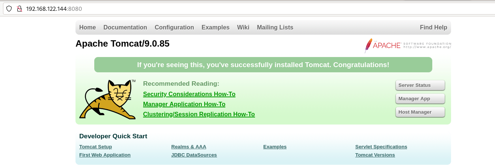
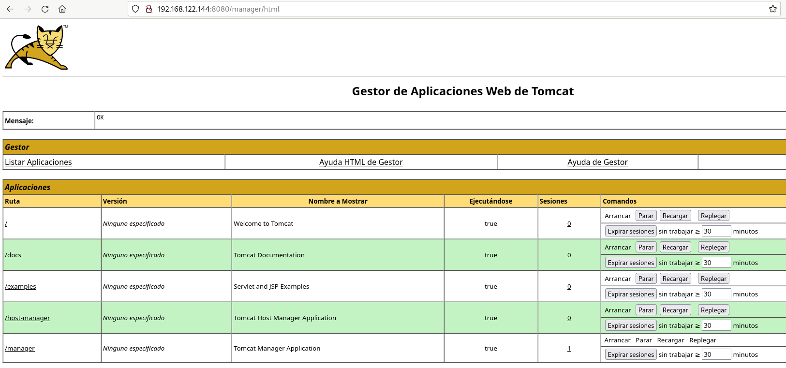
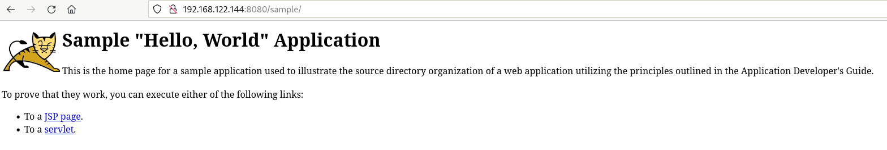

# Ejemplo 5: Configuración de imágenes con una aplicación Java

En este ejemplo vamos a estudiar como podemos trabajar con el [Servidor de Aplicaciones Apache Tomcat](https://tomcat.apache.org/). Para hacer las pruebas vamos a usar la imagen Docker `bitnami/tomcat` cuya [documentación](https://hub.docker.com/r/bitnami/tomcatJava) puedes encontrar en Docker Hub.

Puedes encontrar los ficheros necesarios en el [Repositorio con el código de los ejemplos](https://github.com/josedom24/ejemplos_curso_docker_ow).

En primer lugar vamos a crear un contenedor Docker desde la imagen `bitnami/tomcat` y vamos a hacer un despliegue de un fichero war de forma manual. Además vamos a configurar el contenedor para indicar el usuario y la contraseña que nos va a permitir acceder a la web de administración de Tomcat. Para ello ejecutamos:

```bash
$ docker run -d -p 8080:8080 -e TOMCAT_USERNAME=admin -e TOMCAT_PASSWORD=my-password --name mytomcat bitnami/tomcat:9.0
```

Podemos acceder desde un navegador web, y entraríamos en la página principal de Tomcat:



Si accedemos a la URL `/manager/html` entraremos a la zona de administración. Para acceder tendremos que indicar el nombre y la contraseña que hemos indicado en las variables de entorno:



Podríamos hacer el despliegue de la aplicación de ejemplo que tenemos desde la zona de administración, pero vamos a copiar el fichero war directamente al directorio de despliegue. En esta imagen dicho directorio es `/opt/bitnami/tomcat/webapps` o `/app` que es un enlace simbólico al directorio anterior. De esta manera:

 ```bash
$ docker cp sample.war mytomcat:/app
```

Para entrar a la aplicación podemos acceder a la URL `/sample`:



Por último es muy sencillo crear una nueva imagen con nuestra aplicación desplegada. El fichero `Dockerfiile` sería de la siguiente forma:

```Dockerfile
# syntax=docker/dockerfile:1
FROM bitnami/tomcat:9.0
COPY sample.war /opt/bitnami/tomcat/webapps
```

Creamos la nueva imagen y ejecutamos un nuevo contenedor:

```bash
$ docker build -t josedom24/app_java:v1 .
$ docker run -d -p 8081:8080 -e TOMCAT_PASSWORD=my-password --name app_java josedom24/app_java:v1
```

Finalmente podemos acceder a la aplicación utilizando un navegador web.
